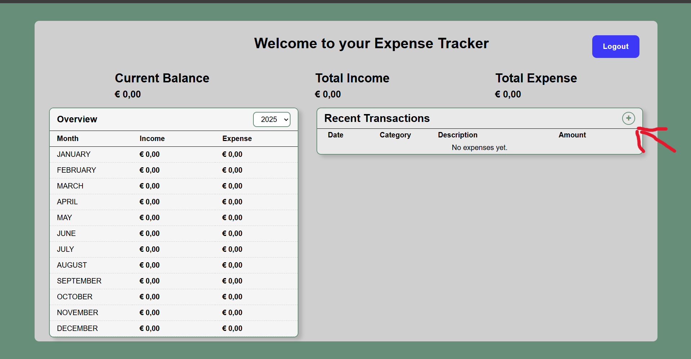
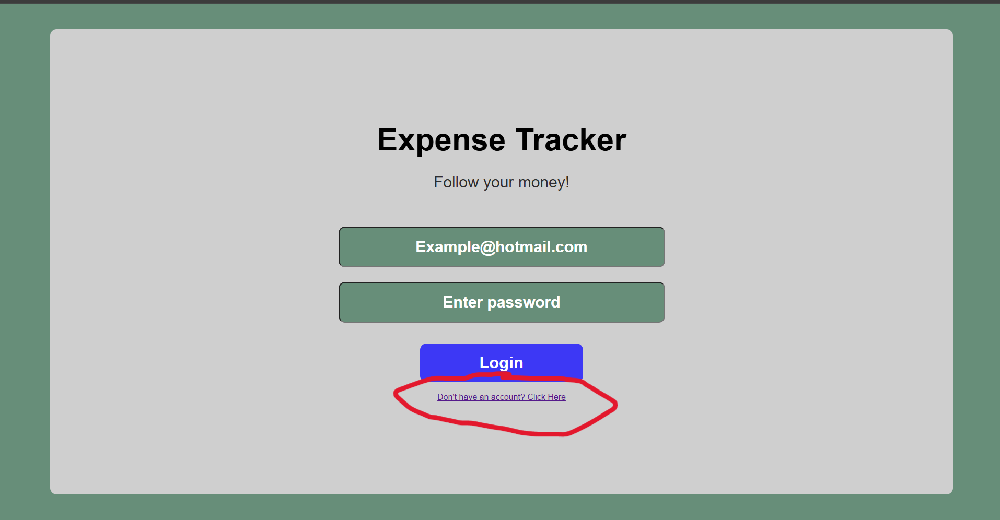
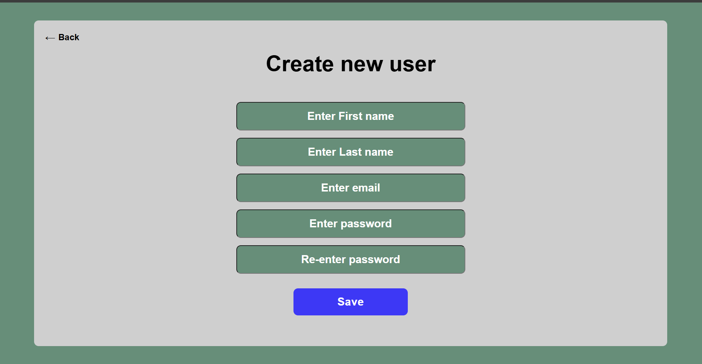
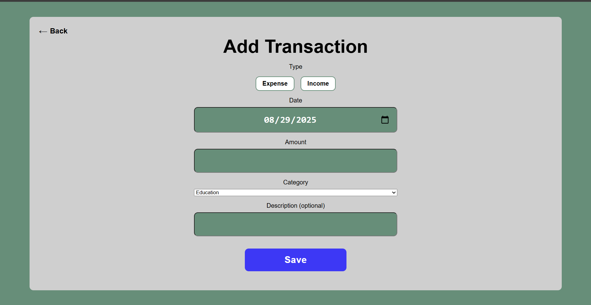

# Expense Tracker

A simple browser-based expense tracker application built with Java 21, Maven, Spring Boot, PostgreSQL, Hibernate and Thymeleaf.  
It helps users manage income and expenses, track spending habits, and visualize financial data.

## Features
- Add, edit, and delete expenses
- Categorize transactions (e.g., Food, Transport, Bills)
- View summary of expenses
- Search/filter transactions
- Responsive UI for desktop and mobile (in development)

##Screenshots

### Login Page

### Create User

### Add Transactions Form

